

  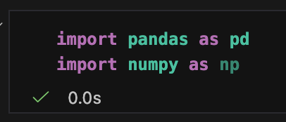 
    pandas: Used for data manipulation and analysis (DataFrames).

    numpy: Used for numerical operations.   

   
  We load two CSV files: movies contains metadata (budget, genres, etc.), and credits contains information about the cast and crew.

  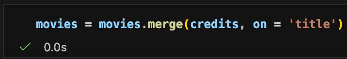 
  Since both files share a title column, we merge them into a single DataFrame to have all information in one place.

  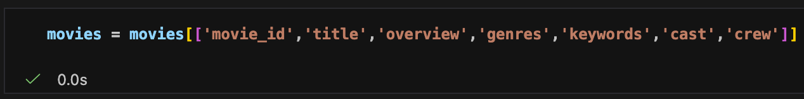 
  We discard unnecessary columns (like budget, popularity, release date) and keep only the features that help define the "content" of a movie for recommendation.

   
  dropna(): Removes rows with missing values (inplace -> modifies the actual csv file).

  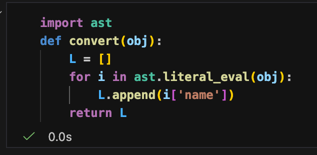 
  function that helps to convert every word into list and append in list L then return the list

  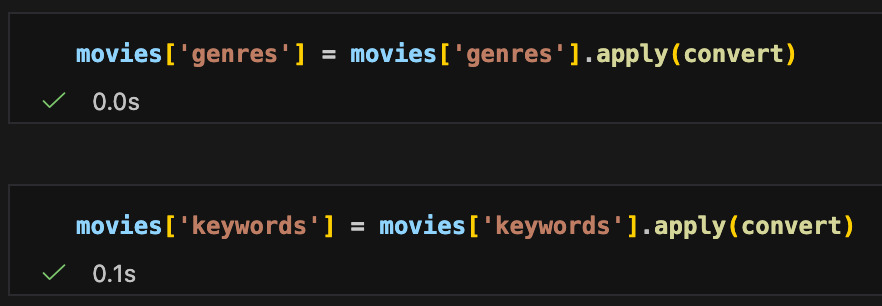 
  converting genres and keyword with the help op convert function

  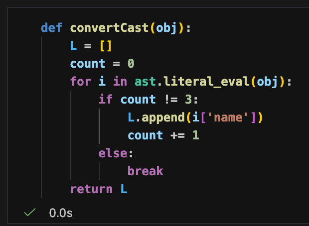 
  function that helps us to detect top 3 charater from the cast and return the list

   
  converting the cast data using the convertCast function.

  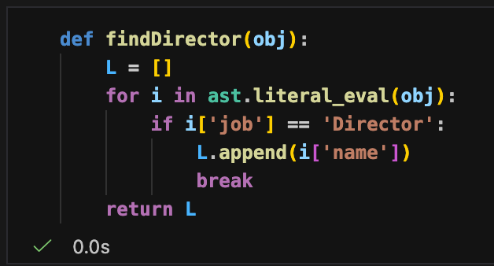 
  helps to find the director from the given data

  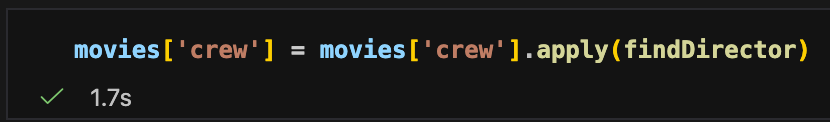 
  crew data is send to the findDirector function and stored the returned data in the crew

  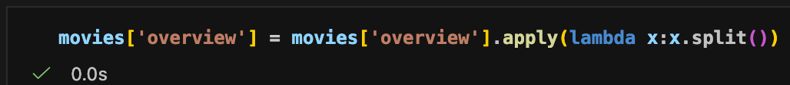 
  splitting the overview data

  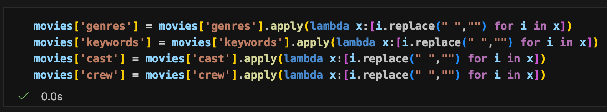 
  We remove spaces between names ("Johnny Depp" becomes "JohnnyDepp"). This is crucial so that the vectorizer treats the full name as a single unique entity/tag.

  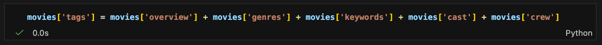 
  creating a new column name tags that have overview genres keywords cast crew

  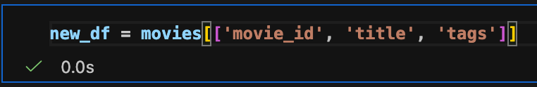 
  creating new data frame called new_df having movie_id, title, tags

  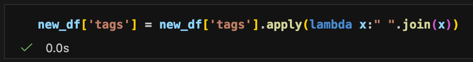 
  converting tags data into string

  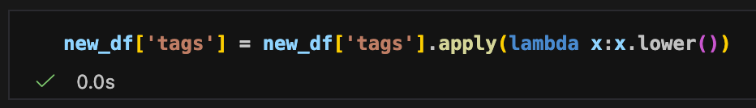 
  lowercasing the string of the tags

  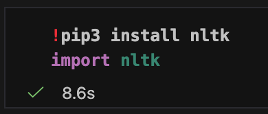 
  installing nltk and importing nltk

  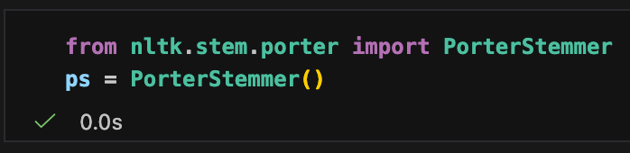 
  We use stemming to convert words to their root form (e.g., "activities" and "activity" both become "activi"). This prevents the model from treating different forms of the same word as different tags.

  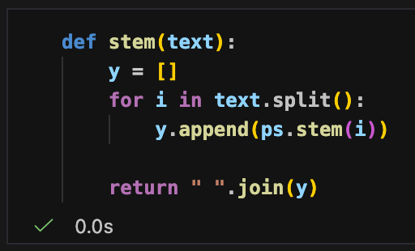 
  stem function helps to merge the same type of words

  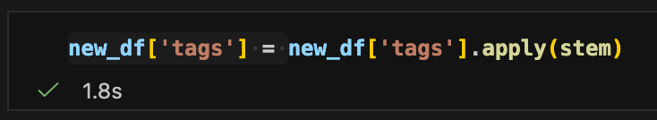 
  giving tags data to the stem function

  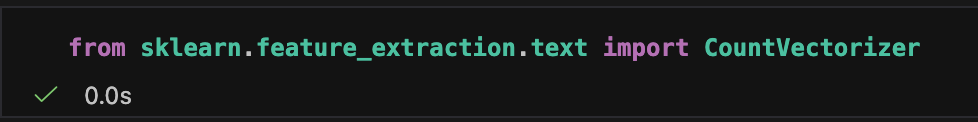 
  importing skit learn to use vectorize calss

  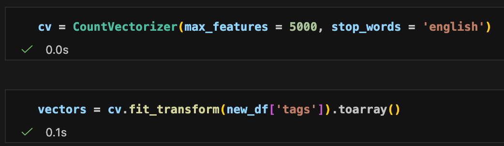 

  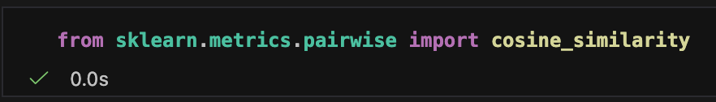 
  to use cosine_similarity

  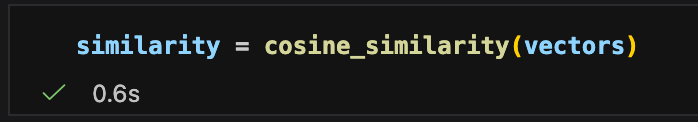 
  assign the value of distance in the similarity

  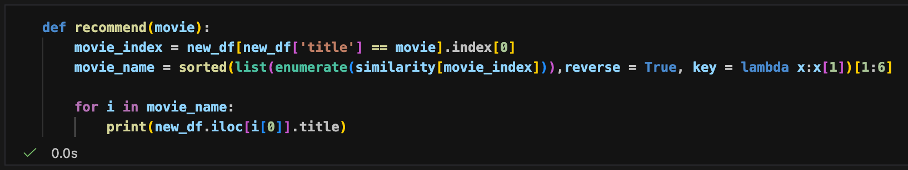 
  recommend function

  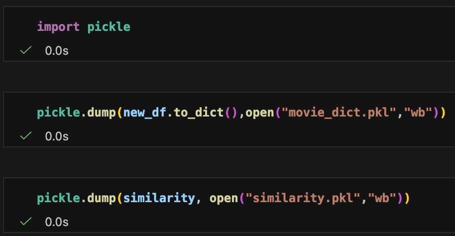 
  creating .pkl file to use these file in the streamlit

