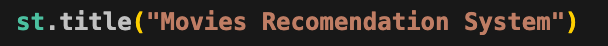
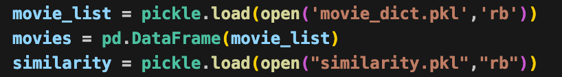
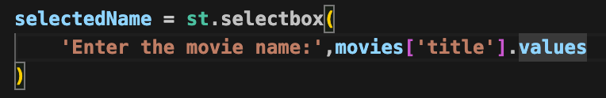
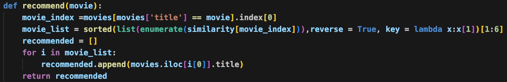
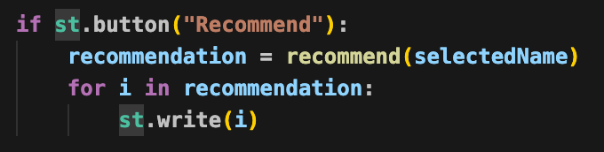

<h1 align = "center">Movie Recommendation System</h1>

<h3>Building the Model:</h3>

   
    importing pandas and numpy 
    pandas: Used for data manipulation and analysis (DataFrames).
    numpy: Used for numerical operations.   

   
  We load two CSV files: movies contains metadata (budget, genres, etc.), and credits contains information about the cast and crew.

   
  Since both files share a title column, we merge them into a single DataFrame to have all information in one place.

   
  We discard unnecessary columns (like budget, popularity, release date) and keep only the features that help define the "content" of a movie for recommendation.

   
  dropna(): Removes rows with missing values (inplace -> modifies the actual csv file).

   

ast stands for Abstract Syntax Trees.

The problem with the dataset is that a list like [{"id": 28...}] is wrapped in quotes, making it a string. If you try to loop through a string, Python treats every character as an item.

1. ast.literal_eval():
a function that safely evaluates a string and converts it into its original Python data structure (in this case, a list).

2. def convert(obj):
This defines the function named convert which takes one input, obj (the string from the dataframe cell).

3. L = []: 
A local empty list is initialized to store the extracted names.

4. for i in ast.literal_eval(obj):
First, ast.literal_eval(obj) turns the string into a real Python list.
Then, the for loop iterates through every dictionary inside that list.

5. L.append(i['name']):
Inside each dictionary (i), there is a key called 'name' (which contains the genre name like "Action").
This line extracts that value and adds it to our list L.

6. return L:
Once the loop finishes checking all dictionaries in that cell, the function returns the final list of strings.

   
  converting genres and keyword column into list with the help op convert function and assign in those columns

   

  
need top 3 charater mentioned the cast:

1. def convertCast(obj)::
Defines a function that takes obj (the string representing the list of cast members) as input.

2. L = [] and count = 0:
L is an empty list to store the names of the actors.
count is a counter variable initialized to zero to keep track of how many actors we have added.

3. for i in ast.literal_eval(obj)::
Just like in the genre function, ast.literal_eval converts the string into a real Python list of dictionaries so we can loop through it.

4. if count != 3::
This is a conditional check. It tells the loop: "As long as we haven't reached 3 names yet, keep going."

5. L.append(i['name']) and count += 1:
It extracts the actor's name from the current dictionary and adds it to our list L.
It then increments the count by 1.

6. else: break:
Once the count reaches 3, the if condition becomes false, the else block triggers, and the break statement stops the loop immediately. This ensures we don't process hundreds of minor actors in a movie.

7. return L:
The function returns the list containing the names of the top 3 actors (e.g., ['Robert Downey Jr.', 'Chris Evans', 'Mark Ruffalo']).

   
  to get top 3 character the cast data is giveing to the convertCast function and assigning the returned list into the cast 

   
  
  

we need director form the crew column

1. def findDirector(obj):
This line defines the function. It accepts obj, which is a string containing the full crew list (directors, producers, editors, camera operators, etc.).

2. L = []
An empty list is initialized to store the Director's name.

3. for i in ast.literal_eval(obj):
ast.literal_eval(obj) converts the string into a real Python list of dictionaries.
The for loop then starts checking every person (every dictionary) in that list.

4. if i['job'] == 'Director':
Each dictionary in the crew column has a key called 'job'.
This conditional statement checks if the person's job is exactly "Director". It ignores everyone else (like producers or writers).

5. L.append(i['name'])
If the job is "Director", it takes the value from the 'name' key (the person's actual name) and adds it to our list L.

6. break
This is a crucial line. Once the function finds the Director and adds them to the list, the break command stops the loop immediately.
We use break because most movies have only one main director, and searching through the rest of the thousands of crew members would waste time.

7. return L
The function returns the final list containing the director's name (e.g., ['Christopher Nolan']).
  

   
  crew data is send to the findDirector function and stored the returned data in the crew

   
  splitting the overview data

   
  We remove spaces between names ("Johnny Depp" becomes "JohnnyDepp"). This is crucial so that the vectorizer treats the full name as a single unique entity/tag.

   
  creating a new column name tags that have overview genres keywords cast crew

   
  creating new data frame called new_df having movie_id, title, tags

   
  converting tags data into string

   
  lowercasing the string of the tags

   
  installing nltk and importing nltk

   
  We use stemming to convert words to their root form (e.g. "activities" and "activity" both become "activi"). This prevents the model from treating different forms of the same word as different tags.

   
  

This function is used for Stemming, which is a Natural Language Processing (NLP) technique to reduce words to their base or root form.

1. def stem(text):
This defines the function named stem which takes a single string of text (in your case, the tags column) as input.

2. y = []
An empty list y is created to store the processed (stemmed) words.

3. for i in text.split():
The text.split() command breaks the long string into individual words (e.g., "loving loved loves" becomes ['loving', 'loved', 'loves']).

The for loop iterates through each word (i) one by one.

4. y.append(ps.stem(i))
ps is the PorterStemmer object from the nltk library.

ps.stem(i) takes a word and converts it to its root. For example, it converts "loving", "loved", and "loves" all into the single root word "love".

This stemmed word is then added to the list y.

5. return " ".join(y)
After all words in the string are stemmed, " ".join(y) takes the list of words and combines them back into a single string, separated by spaces.
  

   
  giving tags data to the stem function

   
  importing skit learn to use vectorize calss to vectorize our data

   
  

1. cv = CountVectorizer(...)
CountVectorizer is a tool from the sklearn library used to implement the Bag of Words model.
It looks at all the words in your tags column and counts how many times each word appears in each movie.

2. max_features = 5000
Your dataset has thousands of unique words. However, not all words are useful (some are very rare).
By setting max_features = 5000, you are telling the vectorizer to only pick the 5000 most frequently occurring words across all movies.
This keeps the model efficient and prevents it from becoming too slow or complex.

3. stop_words = 'english'
In the English language, there are many common words like "is", "the", "and", "in", and "a".
  

  

1. cv.fit_transform(new_df['tags'])
This part does two major things at once:
fit: The CountVectorizer (cv) reads through all the strings in the tags column. It identifies the top 5000 most frequent words (as we specified earlier) and creates a "vocabulary" or a dictionary.
transform: It then goes through every single movie and counts how many times each of those 5000 words appears in that specific movie's tags.

2. .toarray()
By default, the fit_transform method returns a "Sparse Matrix." A sparse matrix is a memory-saving format that only stores the locations of non-zero values (since most movies won't have most of the 5000 words).
.toarray() converts this compressed format into a standard NumPy Array (a dense matrix). This makes it easier to perform mathematical operations, like calculating the distance between movies.

3. vectors = ...
The final result is stored in the variable vectors.
If you check the shape of this variable (vectors.shape), it will be (4806, 5000).
This means you have 4,806 rows (one for each movie) and 5,000 columns (one for each unique word in your vocabulary).

   
  to use cosine_similarity

   
  assign the value of distance in the similarity

   
 

This recommend function is the heart of the project. It identifies which movies are most similar to the one chosen by the user.

1. movie_index = new_df[new_df['title'] == movie].index[0]
Purpose: To find the "ID" or position of the movie in your dataset.
How it works: It searches the title column for the name of the movie the user provided. Once it finds the row, .index[0] extracts the integer index of that row.

2. movie_name = sorted(list(enumerate(similarity[movie_index])), reverse=True, key=lambda x:x[1])[1:6]
This is a complex line that performs several actions:
similarity[movie_index]: This pulls the specific row from your similarity matrix that contains the "similarity scores" for the chosen movie against all other 4,800+ movies.
enumerate(...): Usually, when you sort a list, you lose the original index (position) of the items. enumerate wraps each score with its index (e.g., (index, score)). This allows us to know which movie the score belongs to after sorting.
list(...): Converts the enumerate object into a list.
sorted(..., reverse=True, key=lambda x:x[1]):
It sorts the list in descending order (reverse=True).
key=lambda x:x[1] tells Python to sort based on the similarity score (the second value in our tuple), not the index.

[1:6]:
The movie at index 0 will always be the movie itself (because a movie is 100% similar to itself).
We skip the first one and take the next 5 movies, which are the most similar ones.

3. for i in movie_name:
This loop iterates through the list of 5 tuples we just created (the top 5 recommendations).

4. print(new_df.iloc[i[0]].title)
i[0]: This is the index of the recommended movie.
new_df.iloc[...]: This locates the row in the dataframe using that index.
.title: Finally, it grabs the actual title of the movie and prints it to the console.

   
  creating .pkl file to use these file in the streamlit

<h3>StreamLit</h3>

  
  

streamlit: Turns your Python script into a webpage. It provides the buttons, sliders, and text boxes users interact with.

pandas: Acts as the translator. It takes the raw user input and organizes it into a table (DataFrame) that your model understands.

pickle: Is the delivery service. It unfreezes (loads) your saved machine learning model from your hard drive into the app's memory.
  

  
  

    Title of the website
  

  
  

movie_list: Loads a dictionary containing movie metadata (titles, IDs, genres) that you previously saved.

movies: Converts that dictionary into a Pandas DataFrame, making it easy to search, filter, and display titles in your Streamlit app.

similarity: Loads a Similarity Matrix (likely created via Cosine Similarity). This is a large grid of scores where every movie is compared to every other movie to see how "alike" they are.
  

  
  

st.selectbox: Creates the UI element.

'Enter the movie name:': This is the label the user sees above the box.

movies['title'].values: This feeds the "Title" column from your DataFrame into the dropdown as the list of choices.

selectedName: This variable stores whatever movie the user clicks on, allowing you to use it for your recommendation logic.
  

  
  

movie_index: Finds the "row number" of the selected movie in your DataFrame.

similarity[movie_index]: Pulls the specific row from your similarity matrix that contains the "closeness scores" between the chosen movie and every other movie.

enumerate: Pairs each score with its index so you don't lose track of which movie is which after sorting.

sorted(...)[1:6]: Sorts the scores from highest to lowest. It skips index 0 (the movie itself) and takes the next five.

recommended.append(...): Converts those top 5 indices back into actual movie titles.
  

  
  

st.button("Recommend"): This creates the clickable button. In Streamlit, this statement returns True only for the moment it is clicked.

recommendation = recommend(selectedName): It passes the movie selected in your dropdown into your logic function to get the top 5 titles.

for i in recommendation:: It loops through that list of 5 titles.

st.write(i): It prints each title onto the webpage.
  

<h3>How to run the mode:</h3>

1. first run the main_.ipynb file if there is no movie_dict.pkl and similarity.pkl file in the project directory
2. then run the code (streamlit run app.py) int the project terminal
3. Give the movie name then press the recommend button to get the movie recommendation
